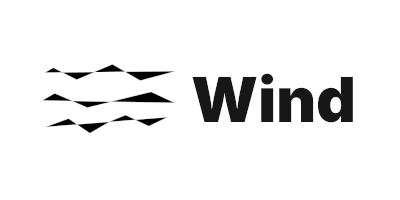
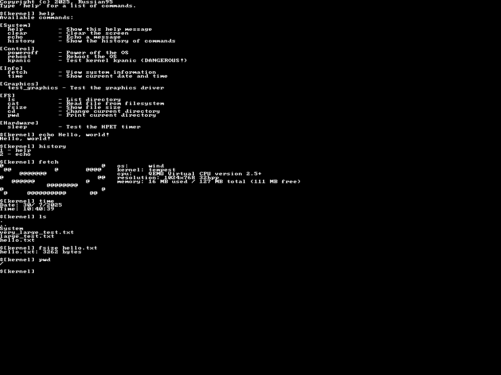

  
  <h1>Wind / Tempest</h1>
  <!-- Badges -->
  

    
    
    
    
    
  

> A minimal OS in POSIX standards, built for modern machines, built from scratch, built to last.

It runs on `x86_64`, has no legacy baggage, and doesn't pretend to be user-friendly.
You break it, you fix it.

## Quick Facts

- **Boot:** Limine + Multiboot2
- **Display:** Framebuffer text & test patterns
- **Input:** Keyboard (US only for now)
- **Shell:** `inish` (basic commands)
- **FS:** Ext2

## Docs

All docs live in [`docs/`](docs/Main.md). Read them first.

## Screenshots

## Why Wind?

- **No bloat.** Just what you need.
- **No magic.** Every bit is visible and hackable.
- **No excuses.** Missing features? Write the code.

## Philosophy

- Transparency: Inspect every line.
- Self-reliance: No hand-holding -- patches welcome.
- Simplicity: Features exist because someone coded them.

## License

This OS/Kernel is released under the GNU General Public License (version 3 or later). Please see [LICENSE](LICENSE)
