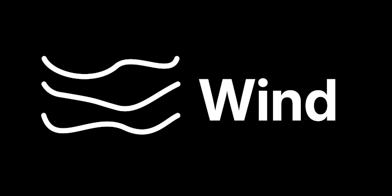

# Wind / Tempest

> A minimal OS for modern machines, built from scratch, built to last.

**Wind** is the operating system.  
**Tempest** is the kernel powering it.

It runs on `x86_64`, has no legacy baggage, and doesn't pretend to be user-friendly.  
You break it, you fix it.

## Quick Facts

- **Boot:** Limine + Multiboot2  
- **Display:** Framebuffer text & test patterns  
- **Input:** Keyboard (US only)  
- **Shell:** `inish` (basic commands)  
- **FS:** Ext2

## Docs

All docs live in [`docs/`](docs/Main.md). Read them first.

## Why Wind?

- **No bloat.** Just what you need.  
- **No magic.** Every bit is visible and hackable.  
- **No excuses.** Missing features? Write the code.

## Build

Requirements:

- `x86_64-elf` cross-compiler  
- `nasm`

## Run

Supported targets:

- QEMU
- Bochs
- Real hardware (good luck)

Must support Multiboot2/Limine.

## Philosophy

- Transparency: Inspect every line.
- Self-reliance: No hand-holding -- patches welcome.
- Simplicity: Features exist because someone coded them.

## License

Licensed under the [AGPL (version 3)](LICENSE).