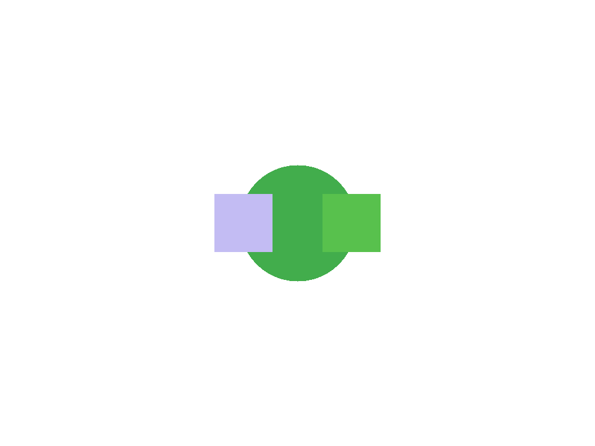

  <h1>Wind / Tempest</h1>
  <!-- Badges -->
  

    
    
    
    
    
  

Wind/Tempest is a barebones POSIX-like OS. Built from scratch, for amd64.

## Core Features

- **Boot:** Limine + Multiboot2
- **Display:** Framebuffer text & test patterns
- **Input:** Keyboard (US only for now)
- **Shell:** `inish` (basic commands)
- **FS:** Ext2

## Documentation

See [`docs/`](docs/Main.md).

## Screenshots

  
  

## Why Wind?

- No bloat.
- No abstraction.
- No excuses.

## Philosophy

- Transparency: Inspect every line.
- Self-reliance: No hand-holding -- patches welcome.
- Simplicity: Features exist because someone coded them.

## License

Wind/Tempest is licensed under the Liberty Software License 1.3. See [LICENSE](LICENSE) for more details.
